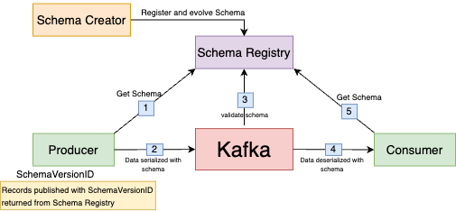
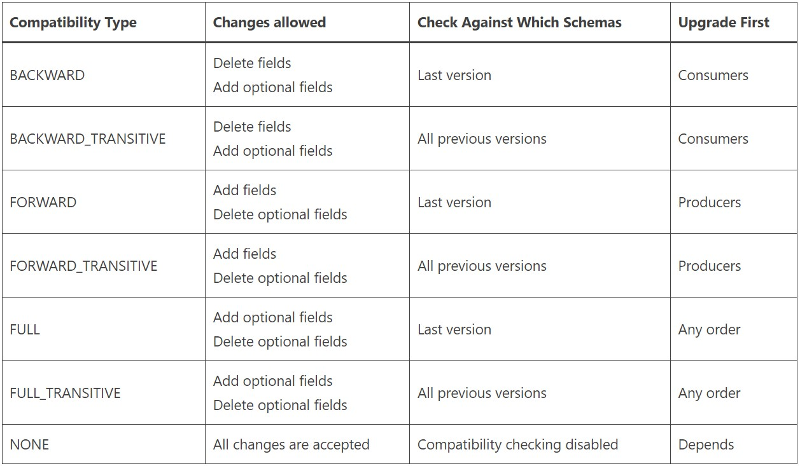
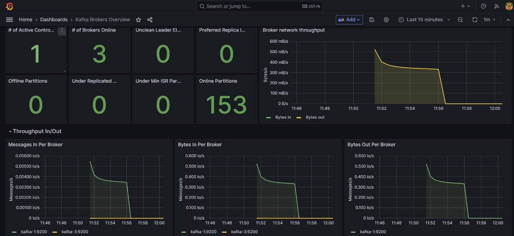

# POC of Outbox Event Pattern

This project showcases the implementation of the Outbox Pattern in Spring Boot, demonstrating how to ensure reliable event publishing by storing event data in an Outbox table within the same database transaction as the primary data modification operations.

## Outbox Event Pattern

The Outbox event pattern is a design pattern used in distributed systems to ensure reliable event publishing while maintaining transactional integrity.

In traditional event-driven architectures, events are often published to a message broker (e.g., Kafka, RabbitMQ) after a successful database transaction. However, this approach can lead to inconsistencies if the message fails to be published or the system crashes before the event is sent.

The Outbox pattern solves this problem by decoupling the event publishing process from the database transaction. Instead of directly publishing events, the application writes event data to an Outbox table within the same database transaction as the primary data modification. This ensures that both the primary data and associated events are either committed or rolled back atomically.

Separately, a background process (e.g., a scheduler, a dedicated service) reads pending events from the Outbox table and publishes them to the message broker. This asynchronous approach guarantees that events are reliably delivered even in the event of failures or system crashes.

By using the Outbox event pattern, developers can achieve consistency and reliability in event-driven systems, enabling seamless integration between different components and ensuring data integrity across distributed environments.

## Exmaple System Design

## Kafka Cluster
The project includes a Kafka cluster composed of three brokers and a single Zookeeper instance, alongside a Schema Registry for managing schemas. This configuration ensures high availability and fault tolerance, as the three brokers can replicate data and provide continuity in case one broker fails.

Zookeeper coordinates the brokers, maintaining configuration information, and managing leader election for partitions.

The Schema Registry is vital as it governs the format and versioning of data, ensuring compatibility between producers and consumers by enforcing schemas during data serialization and deserialization.

This setup enhances data integrity, simplifies application development, and supports robust, scalable, and reliable data streaming and processing within the project.

## Schema Registry
Schema Registry is a standalone server process that runs on a machine external to the Kafka brokers. Its job is to maintain a database of all of the schema versions that have been written into topics in the cluster for which it is responsible.

Schemas are stored by subject (a logical category), and by default, the registry does a compatibility check before allowing a new schema to be uploaded against a subject. Each subject corresponds to a specific Kafka topic or event type, and versioned schemas related to that topic.

Each time we register a new schema for a subject, it gets a unique version identifier. This versioning allows consumers and producers to specify which version of the schema they want to use when serializing or deserializing data.

When a producer sends a message, it calls an API at the Schema Registry REST endpoint and presents the schema of the new message.

- If the schema is the same as the last message produced, then the producer may succeed.
- If the schema is different from the last message but matches the compatibility rules defined for the topic, the producer may still succeed.
- But if the schema is different in a way that violates the compatibility rules, the producer will fail in a way that the application code can detect.

Likewise, on the consumer side, it uses the registry to fetch the sender’s schema. If a consumer reads a message that has an incompatible schema from the version the consumer code expects, the Schema Registry will instruct it not to consume the message.

## Compatability Types in Schema Registry

The following table presents a summary of the types of schema changes allowed for the different compatibility types, for a given subject.

The Confluent Schema Registry default compatibility type is BACKWARD. The main reason that BACKWARD compatibility mode is the default is that we can rewind consumers to the beginning of the topic. With FORWARD compatibility mode, we aren’t guaranteed the ability to read old messages.

## Promotheus

The project utilizes Prometheus for monitoring the Kafka cluster, Schema Registry, application, and PostgreSQL database performance and health.

## Grafana

Grafana has been employed for dashboarding within the project, providing visual insights into Kafka cluster, Schema Registry, application, and PostgreSQL database metrics.

